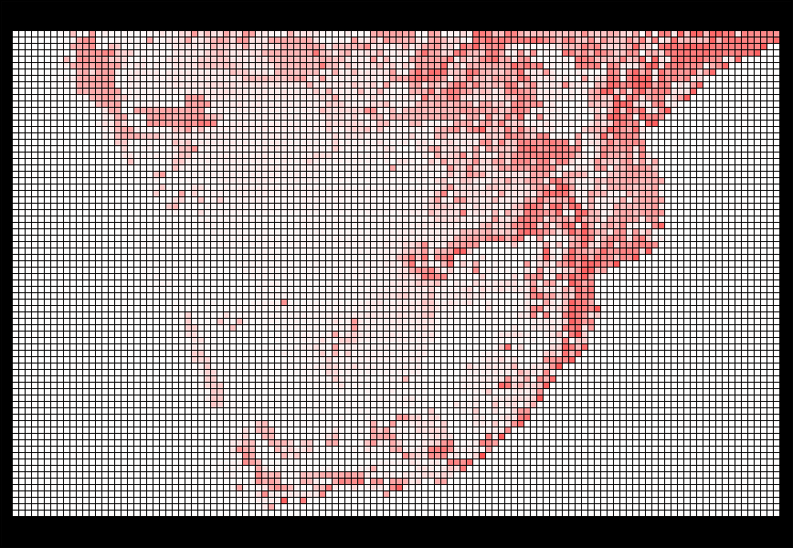

# InferredDistributions
A proof of concept project to see whether it is possible to infer the distribution range of a species based on the recorded observations on iNaturalist using neural networks.

# Example Output
### Brown-Hooded Kingfisher
Below is the map generated by the Neural Network.

Compared to the species page at iNaturalist:

https://www.inaturalist.org/taxa/2346-Halcyon-albiventris

### Knysna Loerie
Below is the map generated by the Neural Network.

Compared to the species page at iNaturalist:

https://www.inaturalist.org/taxa/7205-Tauraco-corythaix

### Orange-Breasted Sunbird
Below is the map generated by the Neural Network.

Compared to the species page at iNaturalist:

https://www.inaturalist.org/taxa/145130-Anthobaphes-violacea

# Notes
While working on this I learnt that, to no surprise, this isn't a new concept and there are many other tools and research projects with similar ideas.

Some good places to start:

https://en.wikipedia.org/wiki/Environmental_niche_modelling

https://en.wikipedia.org/wiki/Biogeography

https://en.wikipedia.org/wiki/Range_(biology)

